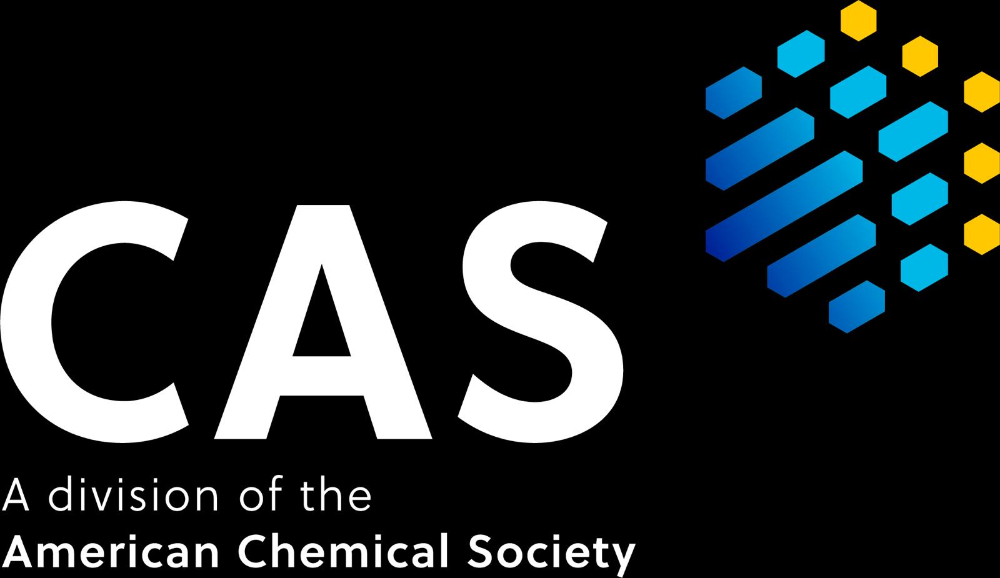

The CAS future leaders program 2024, selected 35 early career scientist, for the next step of our leadership journey. The program provides an all expense paid program in Columbus, Ohio the week before the Fall ACS. The program started in 2010. Currently there is a strong Alumni community, who meet during each spring and fall ACS. 

