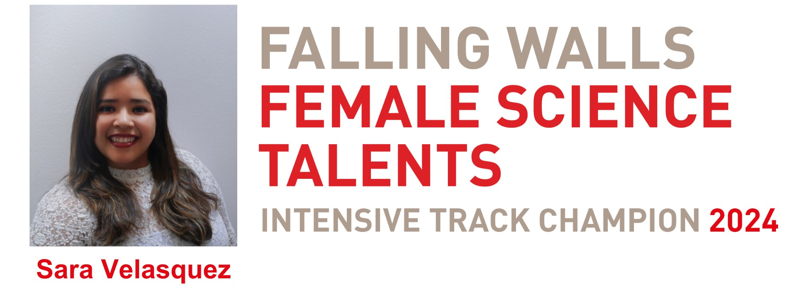

The Intensive Track, offers a year-long support programme for 20 exceptionally talented women across all scientific disciplines, with the aim of guiding them toward achieving significant career breakthroughs.The program consists of 2 gatherings in Berlin, Germany. As well, throughout the year, online events and mentoring opportunities, support to build an international network and increase the global recognition.   

