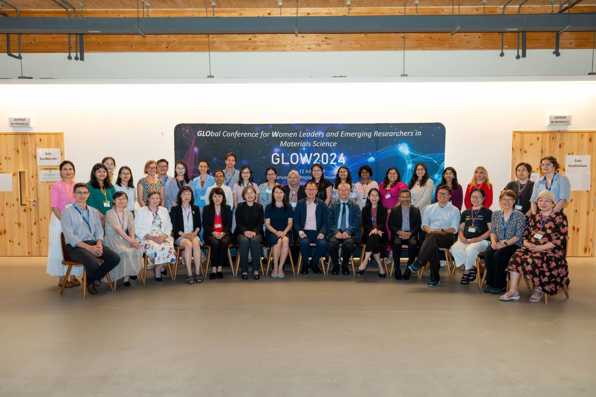

The NanoDivision's Student Award recognizes current students or students within one year post graduation for their research contributions related to renewable nanomaterials and service to the NanoDivision and other professional societies.

