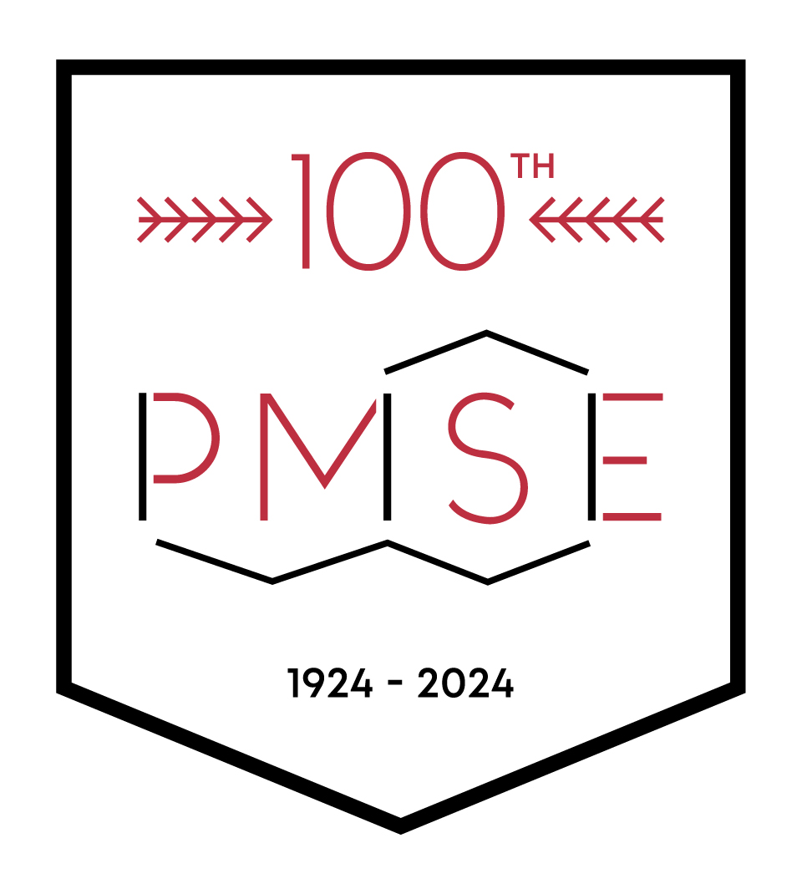

This special PMSE Centennial Symposium seeks to recognize the accomplishments of graduate students and postdoctoral researchers who have made significant contributions to their respective fields within polymer materials science and engineering (e.g., synthesis, processing, characterization, physics and engineering of polymeric materials) and aim to pursue career paths in academia, national or government laboratories, and industry.

