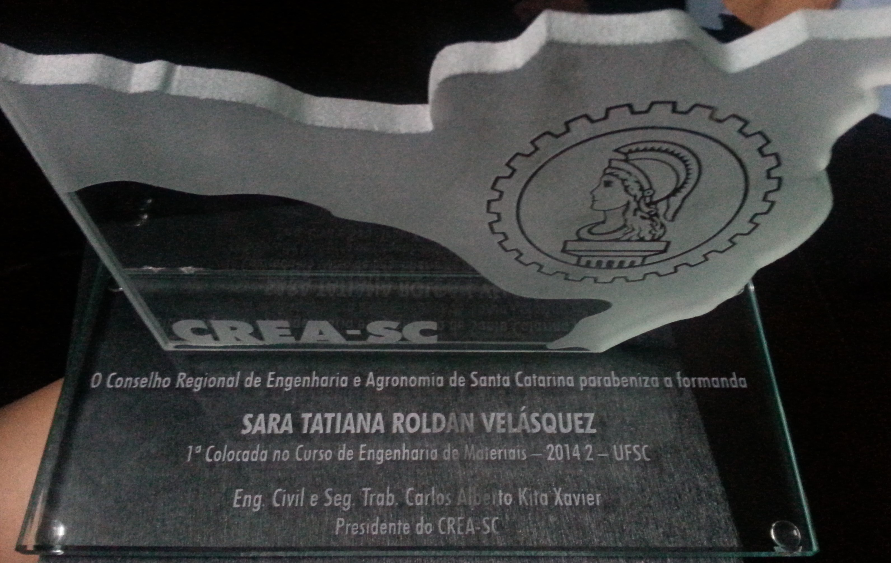

The Federal University of Santa Catarina gives an award for the best student of each graduating generation. The award is decided by the grade point average among the graduating students in each generation. On the first semester of 2015, I received the award, recognized as well by the Regional Engineering and Agronomy Council from the state of Santa Catarina, Brazil  

