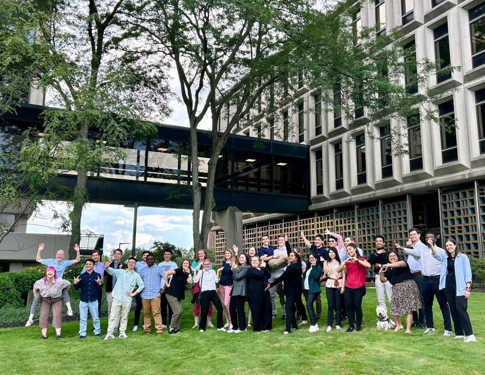

While on my flight from Columbus, Ohio to ACS Fall Meeting in Denver, Colorado, I  have had a bit of time to relect on the CAS Future Leaders program 2024. I was lucky enough to be one of the 35 selected for the program this year. 

The programme started on Sunday evening with a dinner, where I met the other participants, all of whom are doing amazing work spanning different areas of chemistry and materials research.

On Monday, the program was fully based on story telling from the Story collider, they did an awsome job teaching us how to tell our scientific story from different perspectives to cater to different audiences. We ended the day with a dinner at Centre of Science and Industry (COSI) complete with private visits to some of the exhibits, a particular highlight was a section on colors, which I always loved given my bioinspired materials background. 

On Tuesday, we visited CAS headquarters. In the morning we had presentations from ACS Membership, ACS publications and learned how the CAS content operations work. The content operations chemical formula input was amazing! I was really amazed by it and wish I could do so so easily! 
 
During the afternoon we had visit to the data center, Scifinder Q and A and poster presentation. I really enjoyed meeting the CAS staff and especially talking with them about my poster. Even the marketing staff were drawn in by my images, so I cannot be doing too badly with them 😅. The day ended with a BBQ and kickball game, proving scientists can also have fun. 

The next day, Scitrain facilitated an amazing course on coaching, we learned a lot about different approaches, from each other and walked through different scenarios. Special thanks to Noah for acting as my "student". And the ACS coaching journal will accompany me for many years to come. 

The focus the next day moved on to EDI and Scicomm, which are a particular passion for me. The more I learn about it, the more I am inspired to work with it! 

We ended the day at the kitchen, putting our chemistry training to practical use making flat bread and our new storytelling techniques to develop our brand. Our group got 2nd place both in the taste test and branding 😋. 

Lastly, on Friday we were supposed to have a visit to the local children's hospital - and ever since getting the programme I had wondered what that would involve. Unfortunately after a few of the group came down with Covid the format was switched to an online session, with a very useful panel discussion on applications of chemistry in medicine with the afternoon free to network, see a bit of Columbus and chat with others from the group. 

I hope this has given you a bit of insight into what the CAS program involves, and if you are thinking about applying what are you waiting for? 🤩 It is really amazing program, and I cannot thank Peter, Nicole, Erika and the rest of the CAS team and other organizers enough for putting it together. 

