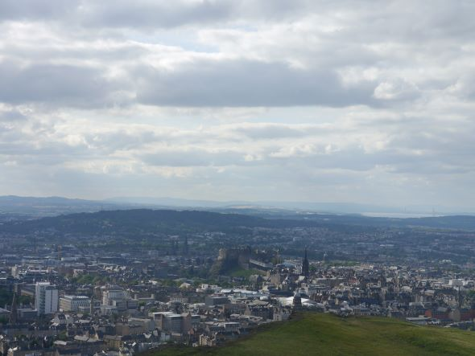

Imagine going for a walk with your dog and instead of bringing home a stick, you bring a new research idea for your next grant proposal. Sounds wonderful right? This is actually possible!  

During my undergrad, around 10 years ago, I heard the term bioinspiration for the first time. This wonderful yet simple premise, of grabbing inspiration from nature to develop new technologies and solve societal problems caught my imagination. With time I got more involved with the concept and marveled at the universe of possibilities it unlocked – and it could be beneficial to you too. 

"The wisest and noblest teacher is nature itself." - Leonardo da Vinci, scientist, engineer, and artist 

A bioinspired material that became widely used in day-to-day life is Velcro, invented by George de Mestral, a Swiss engineer, in the 1940s. The idea came from a hunting trip in the Jura mountains. Like many a hiker before and since he realized that the tiny hooks of the cockie-burs were tightly stuck on his pants and his dog’s fur. Later he put one under the microscope, where he saw thousands of hooks which latched on to any fabric or dog hair that passed by. Despite only hitting the market in the early 1960s Velcro has seen become ubiquitous.  

Bioinspiration does not only focus on small materials, but also big engineering marvels like the bullet trains, which were inspired by the kingfisher birds beak. Japanese engineers needed to reduce the noise the trains caused when entering tunnels without losing speed. By mimicking the kingfisher birds beak, the trains became 10% faster, consumed 15% less electricity and were less noisy.

A year ago I started to develop my first project idea for grant applications. As I spend most of my free time with my dog, many jokes came, that she needed to be my source of inspiration. But my first reaction was no, how is this possible, what do a dog and chemistry research have in common? I am working with sustainable materials and some even think owning a dog is not even sustainable! After a long time walking and thinking about our trips, happy moments and the odd small accident, I had a light bulb moment. I remembered a wonderful hiking trip to Liechtenstein. Despite the wonderful weather and the great memories we took home, we encountered a horrible enemy, ticks, lots and lots of ticks. Most we managed to remove on the spot, having a white coated dog has some benefits. However, even then some managed to latch on and stick on my dogs skin. This unfortunate event, my fellow dog owner/hiking partner and I worried. We thought what if the ticks were infected with Lyme’s disease or some other type of tick-borne disease? Are we at risk? Of course, as researchers we did not leave it there, we tried to find more information on how to protect against tick bites, which brought us to the surprising discovery that most solutions are not sustainable and there is no vaccine that can fully protect you from all tick-borne diseases.  

All the research and worries, formed the basis for my first independent research idea, a tick protection method based on sustainable materials, which would avoid more chemical pollution while creating a sustainable solution to a problem that is constantly increasing due to the higher temperatures caused by global warming. While still to find a funding source, I am glad I was able to combined my passion for bioinspiration and dogs in this project. If nothing else, the scientific question has developed incredibly well, been widely accepted by the scientific community and given me the chance to learn a lot about how real research happens – whether your ideas come in the lab, bath, or mountains.  

Therefore, next time you need to find a new research project idea, do not just sit in front of your computer reading an endless merry-go-round of papers. Instead consider taking some days off, relax with your loved ones (2 or 4 legged), and get out to observe nature. Who knows, your next breakthrough project idea might be closer than you imagine.  

