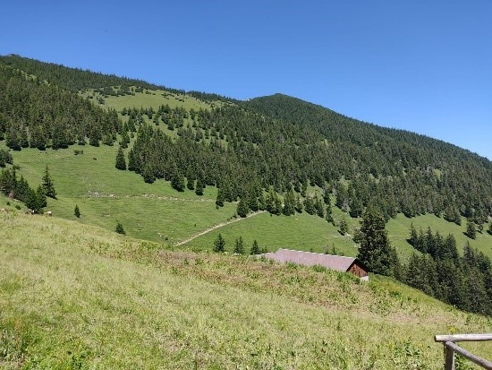

After seeing some excellent websites based on R I decided it was about time to give it a go myself. Over the coming months I will be adding more information about my work as a researcher, as well as details on my teaching and public engagement activities.

I hope that you will find it interesting and perhaps check back from time to time for updates.

