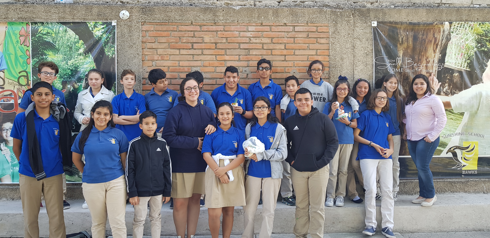

---
title: Outreach throughout my PhD
subtitle: "A recollection of the Outreach activities I have participated throughout my PhD 2018-2022"
weight: 1
author: "Sara T. R. Velasquez"
date: 2023-09-16
draft: false
featured: true
categories:
  - Bioinspiration
  - peptides
  - amphiphilic polymer conetwork
  - APCN

# layout options: single or single-sidebar
layout: single-sidebar
links:
- icon: open-access
  icon_pack: ai
  name: source
  url: https://pubs.acs.org/doi/10.1021/acs.jchemed.3c00355
---

<b>Graphical abstract.</b> TOC image of paper, showing the bioinspiration methods we applied to develop novel APCNs.

A recollection of the different outreach activities I participated throughout my PhD 2018-2022"
excerpt: "2021 - I’m a scientist, Scotland, https://imascientist.org.uk/
2021 - Chemdiverse, University of Strathclyde, Scotland
2020 - 100 voices of academia, mental health posters, by X (twitter) handle @zjayres
2020 - STEM Equal project, International, https://www.stemequals.ac.uk/Initiatives/STEM-Equals-Profiles/Sara-Velasquez
2020 - Working in wellies, Learning outdoors support team, https://blogs.glowscotland.org.uk/ea/learningoutdoorssupportteam/working-in-wellies-sciences-videos/
2020 - 1 of the million, woman in STEM, the WISE campaign, international
2019 - Kidsuni, western Switzerland, organized by the Adolphe Merkle Institute, Switzerland
2018 - Sunshine School outreach activity, Honduras 
 
