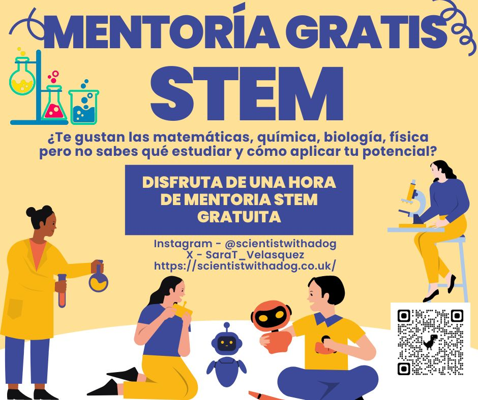

---
title: "STEM Mentoring / Mentoria STEM"
subtitle: "A way to return the knowledge my journey has given me"
excerpt: "Offering STEM mentoring in English, Spanish or Portuguese for underrepresented young students as a way of inspiring the future generations to follow STEM paths."
weight: 1
author: "Sara T. R. Velasquez"
date: 2024-06-20
draft: false
featured: true
categories:
  - Outreach
  - STEM
  - Mentoring

# layout options: single or single-sidebar
layout: single-sidebar
links:
- icon: open-access
  icon_pack: ai
  name: source
  url: 
---

<b>Graphical abstract.</b> 

Through my journey, I had several mentors who supported and encouraged me to get to where I am today. I am aware that without mentoring, role models and the right guidance, it might be harder or even impossible to explore the full academic potential.

As a way to share the knowledge and experiences that have shaped my academic path, and return the mentorship I have previously received and continue receiving,I have started offering individual or school groups mentoring sessions in English, Spanish or Portuguese. 

If interested, please contact me through the google forms: https://forms.gle/sRiStRuGY1dRiqUw8 

### Funding:

