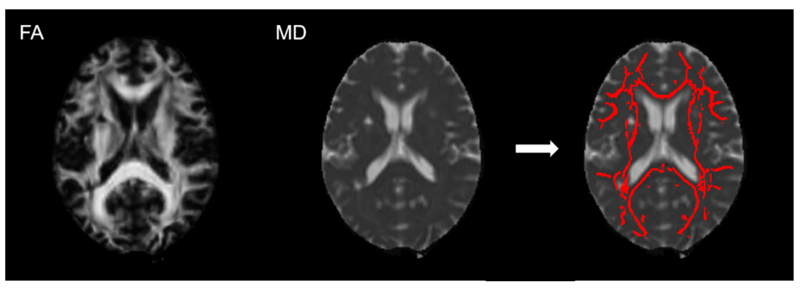

<b>Figure 1.</b> Example of application of peak-width of skeletonised mean diffusivity skeleton template. The fractional anisotropy (FA; left) images were normalised to a standard space and projected into a white matter skeleton template. This transformation was applied to the mean diffusivity (MD) images (middle) and MD skeleton was obtained (right).

## Abstract

### Introduction

Post-stroke cognitive impairment is common and can have major impact on life after stroke. Peak-width of Skeletonized Mean Diffusivity (PSMD) is a diffusion imaging marker of white matter microstructure and is also associated with cognition. Here, we examined associations between PSMD and post-stroke global cognition in an ongoing study of mild ischemic stroke patients. 

### Methods

We studied cross-sectional associations between PSMD and cognition at both 3-months (N = 229) and 1-year (N = 173) post-stroke, adjusted for premorbid IQ, sex, age, stroke severity and disability, as well as the association between baseline PSMD and 1-year cognition. 

### Results

At baseline, (mean age = 65.9 years (SD = 11.1); 34% female), lower Montreal Cognitive Assessment (MoCA) scores were associated with older age, lower premorbid IQ and higher stroke severity, but not with PSMD (?standardized = ?0.116, 95% CI ?0.241, 0.009; p = 0.069). At 1-year, premorbid IQ, older age, higher stroke severity and higher PSMD (?standardized = ?0.301, 95% CI ?0.434, ?0.168; p < 0.001) were associated with lower MoCA. Higher baseline PSMD was associated with lower 1-year MoCA (?standardized = ?0.182, 95% CI ?0.308, ?0.056; p = 0.005). 

### Discussion 

PSMD becomes more associated with global cognition at 1-year post-stroke, possibly once acute effects have settled. Additionally, PSMD in the subacute phase after a mild stroke could help predict long-term cognitive impairment.