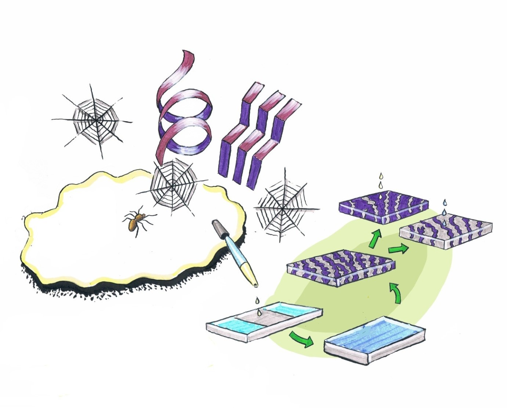

---
title: "Peptide‐Reinforced Amphiphilic Polymer Conetworks"
subtitle: "Sara T. R. Velasquez, Daseul Jang, Peter Jenkins, Peng Liu, Liu Yang, LaShanda T. J. Korley, Nico Bruns"
excerpt: "The mechanical properties of bioinspired amphiphilic polymer conetworks (APCNs) are tailored through the reinforcement with peptide-polydimethylsiloxane-peptide triblock copolymer crosslinkers and characterized through physical, morphological, and mechanical characterization. The obtained results are compared with non-peptidic APCNs which show there is significant improvement in stress, strain, and toughness."
weight: 1
author: "Sara T. R. Velasquez"
date: 2022-09-16
draft: false
featured: true
categories:
  - Bioinspiration
  - peptides
  - amphiphilic polymer conetwork
  - APCN

# layout options: single or single-sidebar
layout: single-sidebar
links:
- icon: open-access
  icon_pack: ai
  name: source
  url: https://doi.org/10.1002/adfm.202207317
---

<b>Graphical abstract.</b> TOC image of paper, showing the bioinspiration methods we applied to develop novel APCNs.

### Funding:
The project received funding from the Partnership for International Research and Education (PIRE) Bio-inspired Materials and Systems, supported by the U.S. National Science Foundation under Grant No. OISE 1844463 and the Swiss National Science Foundation under Grant No. IZPIP0_177995. Moreover, this work benefitted from support from the Swiss National Science Foundation through the National Center of Competence in Research (NCCR) Bio-Inspired Materials (Grant No. 51NF40-182881). 