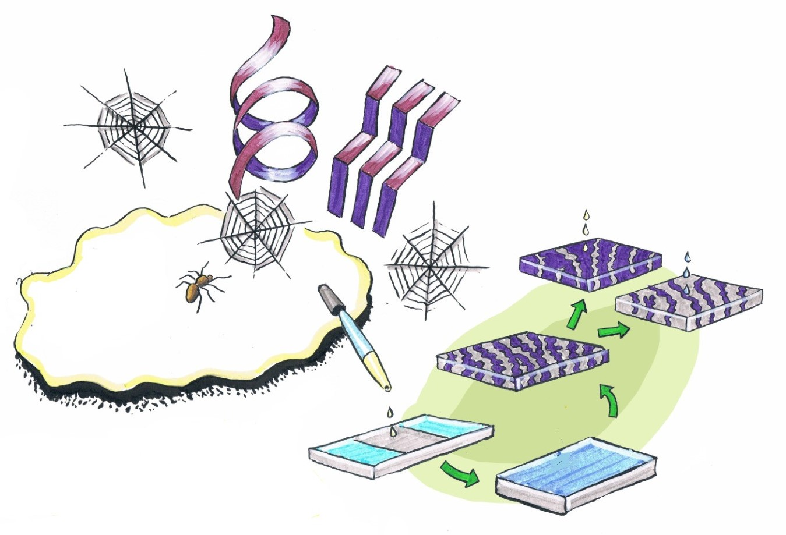

---
title: "Peptide‐Reinforced Amphiphilic Polymer Conetworks"
subtitle: "Improving the mechanical properties of APCNs"
excerpt: "The mechanical properties of bioinspired amphiphilic polymer conetworks (APCNs) are tailored through the reinforcement with peptide-polydimethylsiloxane-peptide triblock copolymer crosslinkers and characterized through physical, morphological, and mechanical characterization. The obtained results are compared with non-peptidic APCNs which show there is significant improvement in stress, strain, and toughness."
weight: 1
author: "Sara T. R. Velasquez"
date: 2024-01-16
draft: false
featured: true
categories:
  - Bioinspiration
  - peptides
  - amphiphilic polymer conetwork
  - APCN

# layout options: single or single-sidebar
layout: single-sidebar
links:
- icon: open-access
  icon_pack: ai
  name: source
  url: https://doi.org/10.1002/adfm.202207317
---

<b>Graphical abstract.</b> TOC image of paper, showing the bioinspiration methods we applied to develop novel APCNs.

## Abstract

### Background

### Aims

### Design

### Outcomes

### Discussion

### Funding:
