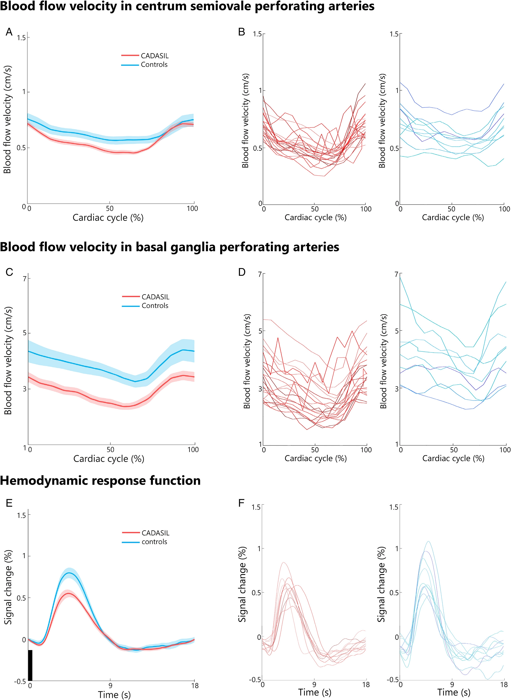

<b>Figure 1.</b> Mean and individual participant traces. The mean blood flow velocity (solid lines) and standard errors of the mean (shaded lines) in perforating arteries in the centrum semiovale (A) and basal ganglia (C) for Cerebral Autosomal Dominant Arteriopathy with Subcortical Infarcts and Leukoencephalopathy (CADASIL) patients and controls. Individual blood flow velocity traces in perforating arteries in the centrum semiovale (B) and basal ganglia (D) for CADASIL patients in red and controls in blue. (E) The mean hemodynamic response function estimates (solid lines) and standard errors of the mean (shaded areas) after 500?ms visual stimulation (black bar) for CADASIL patients and controls. (F) Individual BOLD hemodynamic response function estimates after 500?ms visual stimulation for all CADASIL patients in red and controls in blue.

## Abstract

### Objective

Cerebral small vessel diseases (cSVDs) are a major cause of stroke and dementia. We used cutting-edge 7T-MRI techniques in patients with Cerebral Autosomal Dominant Arteriopathy with Subcortical Infarcts and Leukoencephalopathy (CADASIL), to establish which aspects of cerebral small vessel function are affected by this monogenic form of cSVD.

### Methods

We recruited 23 CADASIL patients (age 51.1?±?10.1?years, 52% women) and 13 age- and sex-matched controls (46.1?±?12.6, 46% women). Small vessel function measures included: basal ganglia and centrum semiovale perforating artery blood flow velocity and pulsatility, vascular reactivity to a visual stimulus in the occipital cortex and reactivity to hypercapnia in the cortex, subcortical gray matter, white matter, and white matter hyperintensities.

### Results

Compared with controls, CADASIL patients showed lower blood flow velocity and higher pulsatility index within perforating arteries of the centrum semiovale (mean difference???0.09?cm/s, p = 0.03 and 0.20, p = 0.009) and basal ganglia (mean difference???0.98?cm/s, p = 0.003 and 0.17, p = 0.06). Small vessel reactivity to a short visual stimulus was decreased (blood-oxygen-level dependent [BOLD] mean difference??0.21%, p = 0.04) in patients, while reactivity to hypercapnia was preserved in the cortex, subcortical gray matter, and normal appearing white matter. Among patients, reactivity to hypercapnia was decreased in white matter hyperintensities compared to normal appearing white matter (BOLD mean difference??0.29%, p = 0.02).

### Interpretation

Multiple aspects of cerebral small vessel function on 7T-MRI were abnormal in CADASIL patients, indicative of increased arteriolar stiffness and regional abnormalities in reactivity, locally also in relation to white matter injury. These observations provide novel markers of cSVD for mechanistic and intervention studies.