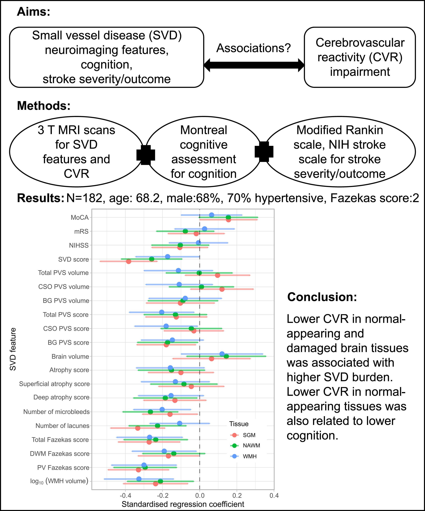

<b>Graphical abstract.</b> Lower CVR in patients with SVD was related to more severe SVD burden and worse cognition.

## Abstract

### Introduction

Cerebrovascular reactivity (CVR) is inversely related to white matter hyperintensity severity, a marker of cerebral small vessel disease (SVD). Less is known about the relationship between CVR and other SVD imaging features or cognition. We aimed to investigate these cross-sectional relationships.

### Methods

Between 2018 and 2021 in Edinburgh, we recruited patients presenting with lacunar or cortical ischemic stroke, whom we characterized for SVD features. We measured CVR in subcortical gray matter, normal-appearing white matter, and white matter hyperintensity using 3T magnetic resonance imaging. We assessed cognition using Montreal Cognitive Assessment. Statistical analyses included linear regression models with CVR as outcome, adjusted for age, sex, and vascular risk factors. We reported regression coefficients with 95% CIs.

### Results

Of 208 patients, 182 had processable CVR data sets (median age, 68.2 years; 68% men). Although the strength of association depended on tissue type, lower CVR in normal-appearing tissues and white matter hyperintensity was associated with larger white matter hyperintensity volume (BNAWM=-0.0073 [95% CI, -0.0133 to -0.0014] %/mm Hg per 10-fold increase in percentage intracranial volume), more lacunes (BNAWM=-0.00129 [95% CI, -0.00215 to -0.00043] %/mm Hg per lacune), more microbleeds (BNAWM=-0.00083 [95% CI, -0.00130 to -0.00036] %/mm Hg per microbleed), higher deep atrophy score (BNAWM=-0.00218 [95% CI, -0.00417 to -0.00020] %/mm Hg per score point increase), higher perivascular space score (BNAWM=-0.0034 [95% CI, -0.0066 to -0.0002] %/mm Hg per score point increase in basal ganglia), and higher SVD score (BNAWM=-0.0048 [95% CI, -0.0075 to -0.0021] %/mm Hg per score point increase). Lower CVR in normal-appearing tissues was related to lower Montreal Cognitive Assessment without reaching convention statistical significance (BNAWM=0.00065 [95% CI, -0.00007 to 0.00137] %/mm Hg per score point increase).

### Discussion

Lower CVR in patients with SVD was related to more severe SVD burden and worse cognition in this cross-sectional analysis. Longitudinal analysis will help determine whether lower CVR predicts worsening SVD severity or vice versa.