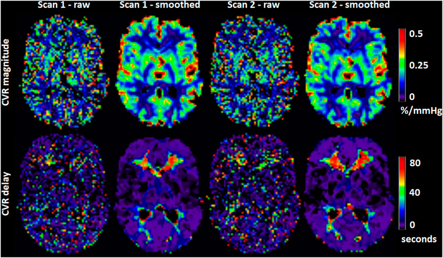

<b>Figure 4.</b> Visual comparison of CVR magnitude and delay maps from scans 1 and 2 in a respresentative volunteer.

## Abstract

### Introduction

Cerebrovascular reactivity (CVR) measurements using blood oxygen level dependent (BOLD) magnetic resonance imaging (MRI) are commonly used to assess the health of cerebral blood vessels, including in patients with cerebrovascular diseases; however, evidence and consensus regarding reliability and optimal processing are lacking. We aimed to assess the repeatability, accuracy and precision of voxel- and region-based CVR measurements at 3 T using a fixed inhaled (FI) CO2 stimulus in a healthy cohort.

### Methods

We simulated the effect of noise, delay constraints and voxel- versus region-based analysis on CVR parameters. Results were verified in 15 healthy volunteers (28.1±5.5 years, female: 53%) with a test-retest MRI experiment consisting of two CVR scans. CVR magnitude and delay in grey matter (GM) and white matter were computed for both analyses assuming a linear relationship between the BOLD signal and time-shifted end-tidal CO2 (EtCO2) profile.

### Results

Test-retest repeatability was high [mean (95% CI) inter-scan difference: -0.01 (-0.03, -0.00) %/mmHg for GM CVR magnitude; -0.3 (-1.2,0.6) s for GM CVR delay], but we detected a small systematic reduction in CVR magnitude at scan 2 versus scan 1, accompanied by a greater EtCO2 change [±1.0 (0.4,1.5) mmHg] and lower heart rate [-5.5 (-8.6,-2.4] bpm]. CVR magnitude estimates were higher for voxel- versus region-based analysis [difference in GM: ±0.02 (0.01,0.03) %/mmHg]. Findings were supported by simulation results, predicting a positive bias for voxel-based CVR estimates dependent on temporal contrast-to-noise ratio and delay fitting constraints and an underestimation for region-based CVR estimates.

### Discussion

BOLD CVR measurements using FI stimulus have good within-day repeatability in healthy volunteers. However, measurements may be influenced by physiological effects and the analysis protocol. Voxel-based analyses should be undertaken with care due to potential for systematic bias; region-based analyses are more reliable in such cases.