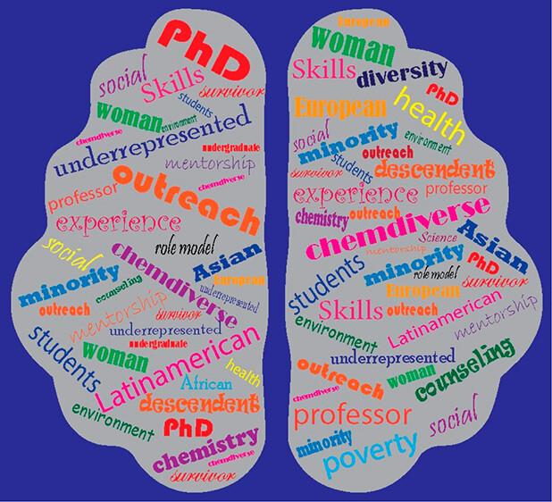

---
title: "ChemDiverse: A Chemistry Careers Activity Showcasing Diversity"
subtitle: "Sara T. R. Velasquez, Roslyn Nimmo, Teena Pookayil, Christopher Lydon, Debra Willison, Fraser J. Scott"
excerpt: "Through profiles of under-represented “success stories” from academia and industry, the ChemDiverse project was developed to encourage under-represented groups to pursue the chemical sciences at higher education level by providing teachers with an easy and structured way of encouraging Scottish high school students into Science, technology, engineering, and mathematics (STEM) higher education. "
weight: 1
author: "Sara T. R. Velasquez"
date: 2023-09-16
draft: false
featured: true
categories:
  - Bioinspiration
  - peptides
  - amphiphilic polymer conetwork
  - APCN

# layout options: single or single-sidebar
layout: single-sidebar
links:
- icon: open-access
  icon_pack: ai
  name: source
  url: https://pubs.acs.org/doi/10.1021/acs.jchemed.3c00355
---

<b>Graphical abstract.</b> TOC image of paper, showing the bioinspiration methods we applied to develop novel APCNs.

### Funding:
Funding aquired through the Royal Society of Chemistry through the CHEMDiverse Project, funded to the University of Stratclyde. 
