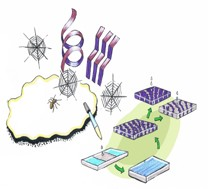

Test of description

## Abstract

### Background

Test

### Aims

Test

### Design

Test

### Outcomes

Test

### Discussion

Test

### Funding:

European Union?s Horizon 2020 programme.

### Trial registration:

NCT03082014.