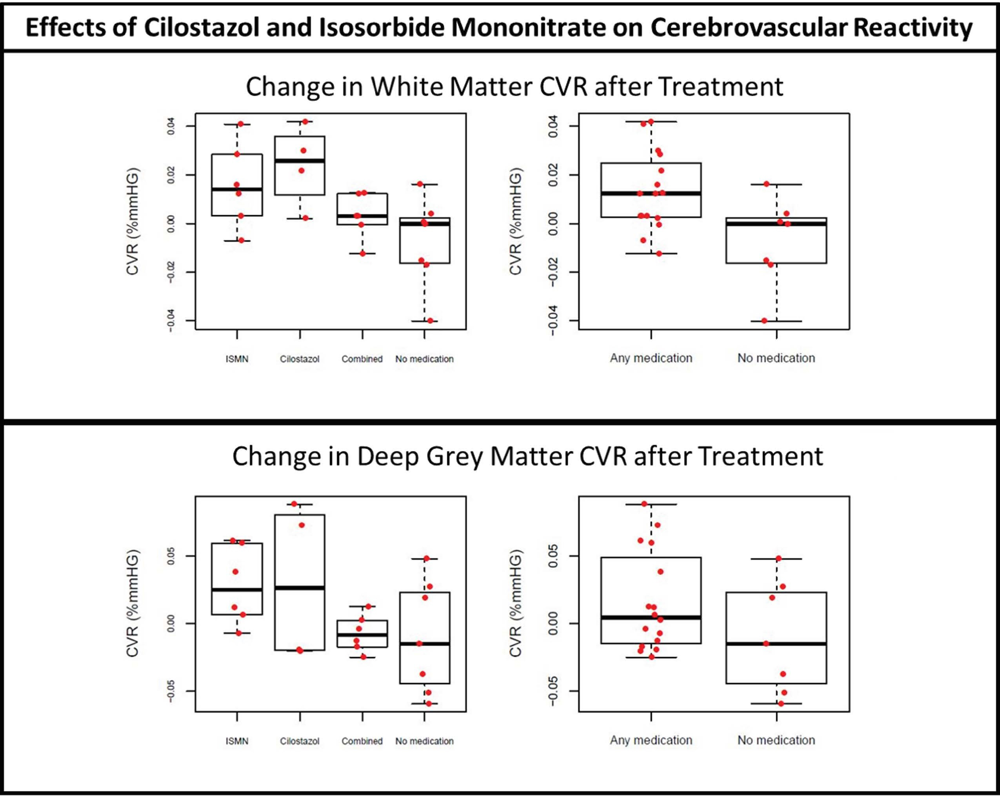

<b>Figure 1.</b> Both white and grey matter CVR magnitude were higher in patients on any vs no medication.

## Abstract

### Background and Purpose
Cerebral small vessel disease—a major cause of stroke and dementia—is associated with cerebrovascular dysfunction. We investigated whether short-term isosorbide mononitrate (ISMN) and cilostazol, alone or in combination, improved magnetic resonance imaging–measured cerebrovascular function in patients with lacunar ischemic stroke.

### Methods
Participants were randomized to ISMN alone, cilostazol alone, both ISMN and cilostazol, or no medication. Participants underwent structural, cerebrovascular reactivity (to 6% carbon dioxide) and phase-contrast pulsatility magnetic resonance imaging at baseline and after 8 weeks of medication.

### Results
Of 27 participants (mean age, 68±7.7; 44% female), 22 completed cerebrovascular reactivity and pulsatility imaging with complete datasets. White matter cerebrovascular reactivity increased in the ISMN (?=0.021%/mm Hg [95% CI, 0.003–0.040]) and cilostazol (?=0.035%/mm Hg [95% CI, 0.014–0.056]) monotherapy groups and in those taking any versus no medication (?=0.021%/mm Hg [95% CI, 0.005–0.037]).

### Conclusions
While limited by small sample size, we demonstrate that measuring cerebrovascular function with magnetic resonance imaging is feasible in clinical trials and that ISMN and cilostazol may improve cerebrovascular function.

### Registration
URL: https://www.clinicaltrials.gov; Unique identifier: NCT02481323. URL: www.isrctn.com; Unique identifier: ISRCTN12580546. URL: www.clinicaltrialsregister.eu; Unique identifier: EudraCT 2015-001953-33.