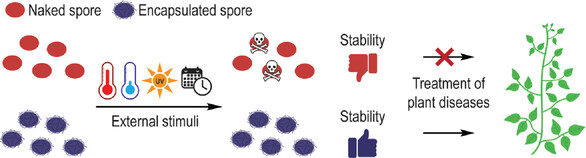

---
title: "Enhancing Stability and Efficacy of Trichoderma Bio-Control Agents Through Layer-by-Layer Encapsulation for Sustainable Plant Protection"
subtitle: "Improving the stability of bio-control agents"
excerpt: "Agricultural fungicide pollution poses environmental and health challenges. Potential alternative bio-control agents, such as Trichoderma fungi, face storage limitations. A new encapsulation method using biobased lignin derivatives improves spore stability significantly. Encapsulated Trichoderma spores show enhanced efficacy in cultivating tomatoes, suggesting a promising and sustainable alternative to chemical fungicides for commercialization."
weight: 1
author: "Sara T. R. Velasquez"
date: 2024-02-16
draft: false
featured: true
categories:
  - Bio-control agents
  - plant protection
  - lignin

# layout options: single or single-sidebar
layout: single-sidebar
links:
- icon: open-access
  icon_pack: ai
  name: source
  url: https://doi.org/10.1002/adsu.202300409
---

<b>Graphical abstract.</b> TOC image of paper, showing the parameters evaluated for Bio-control agents stability improvement

## Abstract

### Background

### Aims

### Design

### Outcomes

### Discussion

### Funding:
This research was realized as part of the project BioHortiTech from the second call of the ERA-NET Cofund SusCrop, being part of the Joint Programming Initiative on Agriculture, Food Security and Climate Change (FACCE-JPI). SusCrop has received funding from the European Union’s Horizon 2020 research and innovation programme under grant agreement No 771134. 
