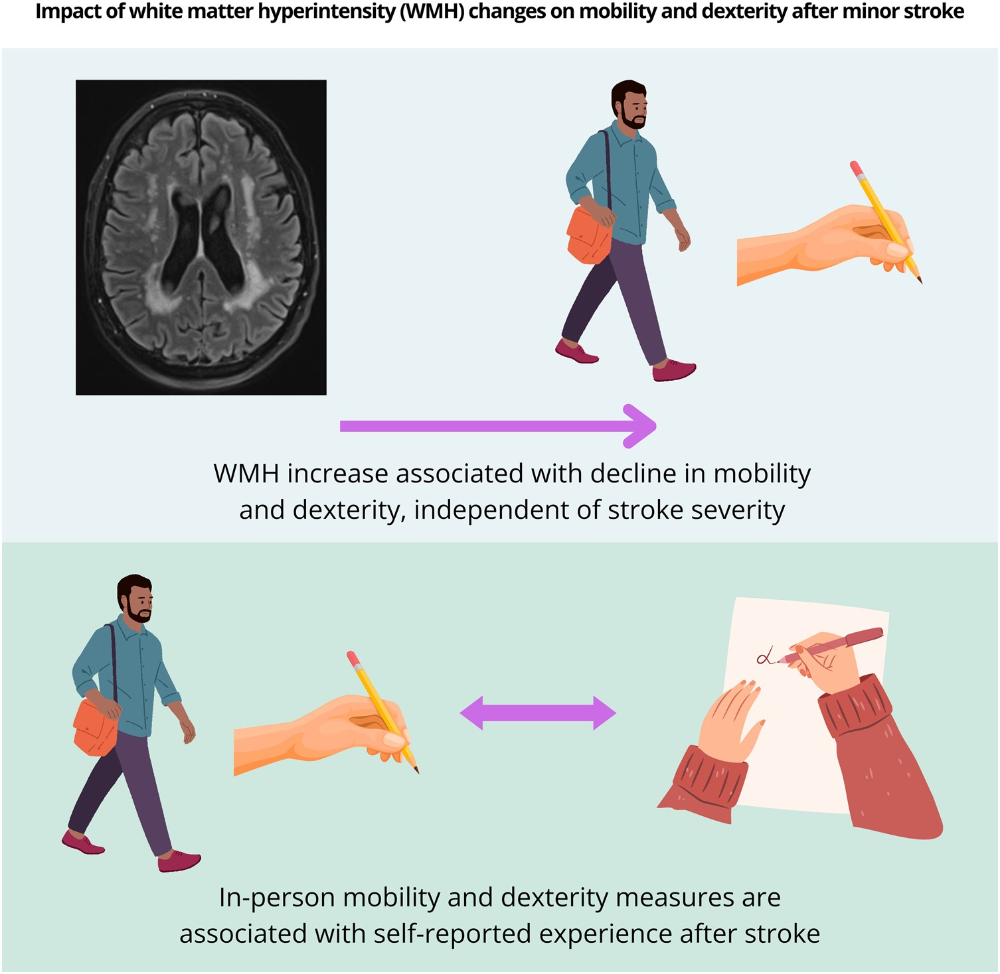

<b>Graphical abstract.</b> Key associations.

## Abstract

### Introduction

White matter hyperintensities (WMH), a common feature of cerebral small vessel disease, are related to worse clinical outcomes after stroke. We assessed the impact of white matter hyperintensity changes over 1 year after minor stroke on change in mobility and dexterity, including differences between the dominant and non-dominant hands and objective in-person assessment versus patient-reported experience.

### Methods

We recruited participants with lacunar or minor cortical ischaemic stroke, performed medical and cognitive assessments and brain MRI at presentation and at 1 year. At both time points, we used the timed-up and go test and the 9-hole peg test to assess mobility and dexterity. At 1 year, participants completed the Stroke Impact Scale. We ran two linear mixed models to assess change in timed-up and go and 9-hole peg test, adjusted for age, sex, stroke severity (National Institutes of Health Stroke Scale), dependency (modified Rankin Score), vascular risk factor score, white matter hyperintensity volume (as % intracranial volume) and additionally for 9-hole peg test: Montreal cognitive assessment, hand (dominant/non-dominant), National Adult Reading Test (premorbid IQ), index lesion side. We performed ordinal logistic regression, corrected for age and sex, to assess relations between timed-up and go and Stroke Impact Scale mobility, and 9-hole peg test and Stroke Impact Scale hand function. 

### Results

We included 229 participants, mean age 65.9 (standard deviation = 11.13); 66% male. 215/229 attended 1-year follow-up. Over 1 year, timed-up and go time increased with aging (standardized ? [standardized 95% Confidence Interval]: 0.124[0.011, 0.238]), increasing National Institutes of Health Stroke Scale (0.106[0.032, 0.180]), increasing modified Rankin Score (0.152[0.073, 0.231]) and increasing white matter hyperintensity volume (0.176[0.061, 0.291]). Men were faster than women (?0.306[0.011, 0.238]). Over 1 year, slower 9-hole peg test was related to use of non-dominant hand (0.290[0.155, 0.424]), aging (0.102[0.012, 0.192]), male sex (0.182[0.008, 0.356]), increasing National Institutes of Health Stroke Scale (0.160 [0.094, 0.226]), increasing modified Rankin Score (0.100[0.032, 0.169]), decreasing Montreal cognitive assessment score (?0.090[?0.167, ?0.014]) and increasing white matter hyperintensity volume (0.104[0.015, 0.193]). One year post-stroke, Stroke Impact Scale mobility worsened per second increase on timed-up and go, odds ratio 0.67 [95% confidence interval 0.60, 0.75]. Stroke Impact Scale hand function worsened per second increase on the 9-hole peg test for the dominant hand (odds ratio 0.79 [0.71, 0.86]) and for the non-dominant hand (odds ratio 0.88 [0.83, 0.93]).

### Discussion

Decline in mobility and dexterity is associated with white matter hyperintensity volume increase, independently of stroke severity. Mobility and dexterity declined more gradually for stable and regressing white matter hyperintensity volume. Dominant and non-dominant hands might be affected differently. In-person measures of dexterity and mobility are associated with self-reported experience 1-year post-stroke.