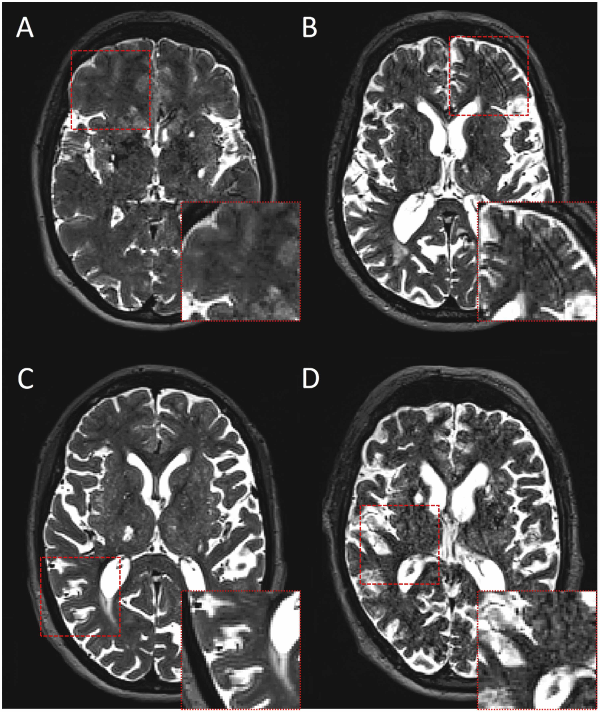

<b>Figure 1.</b> Axial slices of T2-weighted MRI scans illustrating common imaging artefacts.

## Abstract

### Introduction

Growing interest surrounds perivascular spaces (PVS) as a clinical biomarker of brain dysfunction given their association with cerebrovascular risk factors and disease. Neuroimaging techniques allowing quick and reliable quantification are being developed, but, in practice, they require optimisation as their limits of validity are usually unspecified.

### Methods

We evaluate modifications and alternatives to a state-of-the-art (SOTA) PVS segmentation method that uses a vesselness filter to enhance PVS discrimination, followed by thresholding of its response, applied to brain magnetic resonance images (MRI) from patients with sporadic small vessel disease acquired at 3 T. Limits of validity to a SOTA PVS segmentation method applied to 3 T MRI with confounding pathology are given.

### Results

The method is robust against inter-observer differences in threshold selection, but separate thresholds for each region of interest (i.e., basal ganglia, centrum semiovale, and midbrain) are required. Noise needs to be assessed prior to selecting these thresholds, as effect of noise and imaging artefacts can be mitigated with a careful optimisation of these thresholds. PVS segmentation from T1-weighted images alone, misses small PVS, therefore, underestimates PVS count, may overestimate individual PVS volume especially in the basal ganglia, and is susceptible to the inclusion of calcified vessels and mineral deposits. Visual analyses indicated the incomplete and fragmented detection of long and thin PVS as the primary cause of errors, with the Frangi filter coping better than the Jerman filter.

### Discussion

Evidence presented reinforces the STRIVE-2 recommendation of using T2-weighted images for PVS assessment wherever possible. The Frangi filter is recommended for PVS segmentation from MRI, offering robust output against variations in threshold selection and pathology presentation.