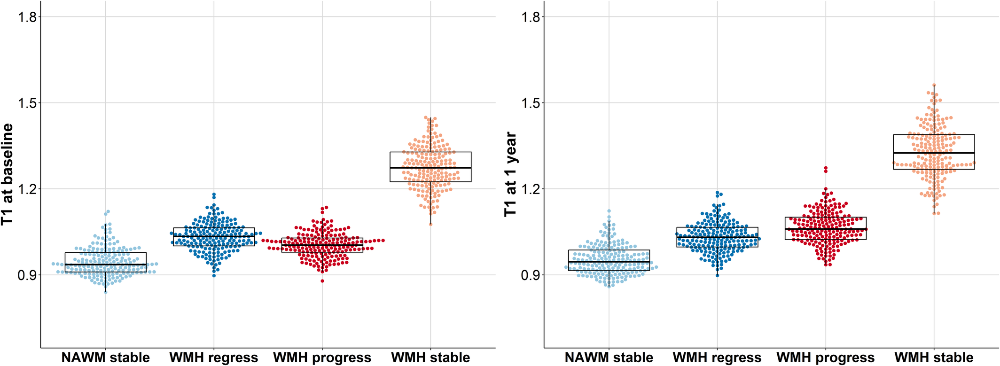

<b>Figure 6.</b> T1 (seconds) at baseline (left) and 1-year (right) in stable NAWM, stable WMHs, and WMH change.

## Abstract

### Introduction

White matter hyperintensities (WMHs) might regress and progress contemporaneously, but we know little about underlying mechanisms. We examined WMH change and underlying quantitative magnetic resonance imaging tissue measures over 1-year in patients with minor ischemic stroke with sporadic cerebral small vessel disease.

### Methods

We defined areas of stable normal-appearing white matter, stable WMHs, progressing and regressing WMHs based on baseline and 1-year brain magnetic resonance imaging. In these areas we assessed tissue characteristics with quantitative T1, fractional anisotropy (FA), mean diffusivity (MD), and neurite orientation dispersion and density imaging (baseline only). We compared tissue signatures cross?sectionally between areas, and longitudinally within each area.

### Results

WMH change masks were available for N=197. Participants' mean age was 65.61-years (SD, 11.10), 59% had a lacunar infarct, and 68% were men. FA and MD were available for N=195, quantitative T1 for N=182, and neurite orientation dispersion and density imaging for N=174. Cross-sectionally, all 4 tissue classes differed for FA, MD, T1, and Neurite Density Index. Longitudinally, in regressing WMHs, FA increased with little change in MD and T1 (difference estimate, 0.011 [95% CI, 0.006–0.017]; -0.002 [95% CI, -0.008 to 0.003] and -0.003 [95% CI, -0.009 to 0.004]); in progressing and stable WMHs, FA decreased (-0.022 [95% CI, -0.027 to -0.017] and -0.009 [95% CI, -0.011 to -0.006]), whereas MD and T1 increased (progressing WMHs, 0.057 [95% CI, 0.050–0.063], 0.058 [95% CI, 0.050 –0.066]; stable WMHs, 0.054 [95% CI, 0.045–0.063], 0.049 [95% CI, 0.039–0.058]); and in stable normal?appearing white matter, MD increased (0.004 [95% CI, 0.003–0.005]), whereas FA and T1 slightly decreased and increased (-0.002 [95% CI, -0.004 to -0.000] and 0.005 [95% CI, 0.001–0.009]).

### Discussion

Quantitative magnetic resonance imaging shows that WMHs that regress have less abnormal microstructure at baseline than stable WMHs and follow trajectories indicating tissue improvement compared with stable and progressing WMHs.