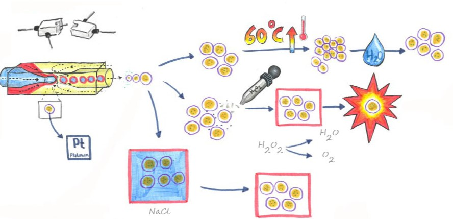

<b>Graphical abstract.</b> TOC image of paper, showing the bioinspiration methods we applied to develop novel APCNs.

### Funding:
The project received funding from the Partnership for International Research and Education (PIRE) Bio-inspired Materials and Systems, supported by the U.S. National Science Foundation under (Grant No. OISE 1844463) and the Swiss National Science Foundation under (Grant No IZPIP0_177995). Moreover, this work benefitted from support from the Swiss National Science Foundation through the National Center of Competence in Research (NCCR) Bio-Inspired Materials (Grant No 51NF40182881). Furthermore, this project has received funding from the European Union’s Horizon 2020 research and innovation programme under the Marie Skłodowska-Curie grant agreement No 101032493 (AB) and funding from the Mac Robertson postgraduate travel scholarship awarded in 2020 by the University of Glasgow and the University of Strathclyde (STRV).
