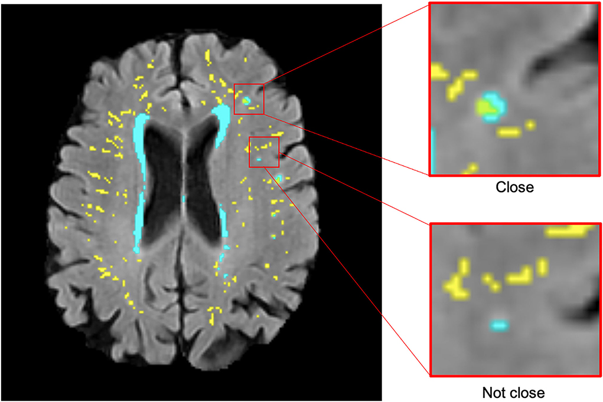

<b>Figure 1.</b> Examples of white matter hyperintensities (cyan) close and not close to perivascular spaces.

## Abstract

### Introduction

Enlarged perivascular spaces (PVS) and white matter hyperintensities (WMH) are features of cerebral small vessel disease which can be seen in brain magnetic resonance imaging (MRI). Given the associations and proposed mechanistic link between PVS and WMH, they are hypothesized to also have topological proximity. However, this and the influence of their spatial proximity on WMH progression are unknown. 

### Methods

We analyzed longitudinal MRI data from 29 out of 32 participants (mean age at baseline = 71.9 years) in a longitudinal study of cognitive aging, from three waves of data collection at 3-year intervals, alongside semi-automatic segmentation masks for PVS and WMH, to assess relationships. 

### Results

The majority of deep WMH clusters were found adjacent to or enclosing PVS (waves?1: 77%; 2: 76%; 3: 69%), especially in frontal, parietal, and temporal regions. Of the WMH clusters in the deep white matter that increased between waves, most increased around PVS (waves?1?2: 73%; 2?3: 72%). Formal statistical comparisons of severity of each of these two SVD markers yielded no associations between deep WMH progression and PVS proximity. 

### Discussion

These findings may suggest some deep WMH clusters may form and grow around PVS, possibly reflecting the consequences of impaired interstitial fluid drainage via PVS. The utility of these relationships as predictors of WMH progression remains unclear.