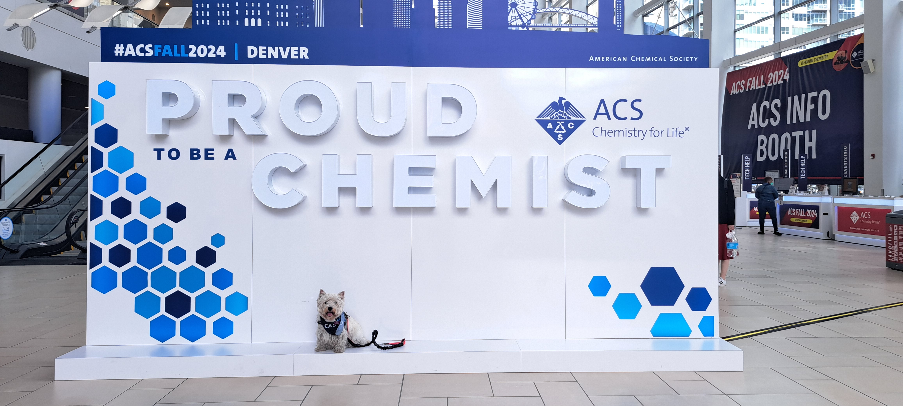
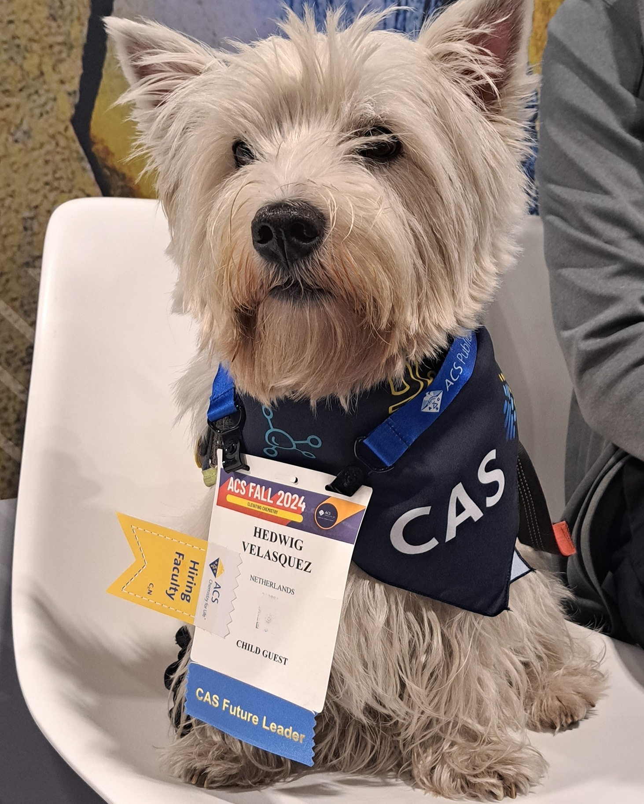

---
title: "CAS Future Leader Dog at the Fall ACS 2024"
subtitle: "The job of an academic puppy never ends"
excerpt: "My experience as the first CAS Future Leader dog at the Fall ACS"
weight: 1
author: "Hedwig Velasquez"
date: 2024-08-16
draft: false
featured: true
categories:
  - Outreach
  - Academic puppy
  - Research Support

# layout options: single or single-sidebar
layout: single-sidebar
links:
- icon: open-access
  icon_pack: ai
  name: source
  url: 
---

<b>Graphical abstract.</b> Hedwig enjoying her time at Fall ACS 2024, Denver, CO.

After a wonderful week in Colombus, OH, we moved to the ACS Fall 2024 conference in Denver, CO. I can only say I had a wonderful time and I am grateful to have been able to be there to support my owner. We met wonderful scientists, Including the ACS president, ACS president-elect and Frances Arnold, 2018 Nobel Laureate. 

I networked a lot and appreciate the inclusivity of the ACS in accepting and acknowledging me accompanying my scientist around the meeting. 

Special thanks to Fernando Gomollon Bel, for introducing me to the ACS President, even before introducing my scientist! 

