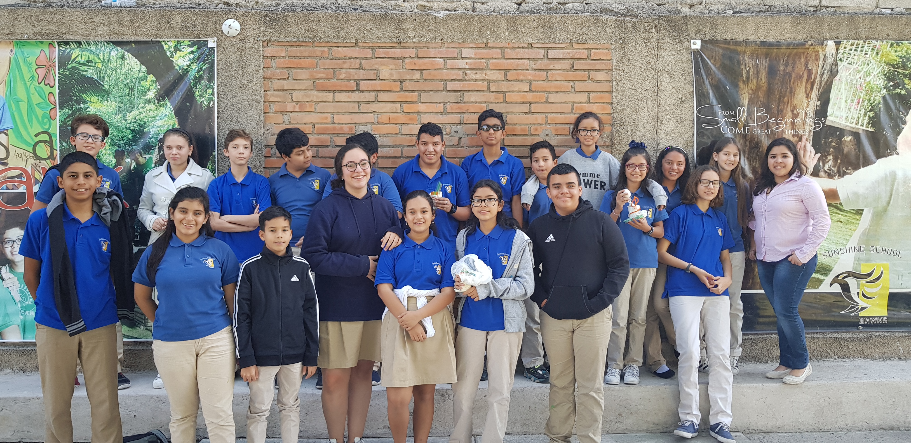

---
title: "Outreach throughout my PhD"
subtitle: "A recollection of the Outreach activities I have participated throughout my PhD 2018-2022"
excerpt: "List of the different outreach activities I participated and organized throughout my PhD studies."
weight: 1
author: "Sara T. R. Velasquez"
date: 2023-09-16
draft: false
featured: true
categories:
  - Outreach
  - STEM
  - Mentoring

# layout options: single or single-sidebar
layout: single-sidebar
links:
- icon: open-access
  icon_pack: ai
  name: source
  url: 
---

<b>Graphical abstract.</b> Outreach activity in Sunshine School, Tegucigalpa, Honduras.

- 2021 - I’m a scientist, Scotland, https://imascientist.org.uk/

- 2021 - Chemdiverse, University of Strathclyde, Scotland

- 2020 - 100 voices of academia, mental health posters, by X (twitter) handle @zjayres

- 2020 - STEM Equal project, International, https://www.stemequals.ac.uk/Initiatives/STEM-Equals-Profiles/Sara-Velasquez

- 2020 - Working in wellies, Learning outdoors support team, https://blogs.glowscotland.org.uk/ea/learningoutdoorssupportteam/working-in-wellies-sciences-videos/

- 2020 - 1 of the million, woman in STEM, the WISE campaign, international

- 2019 - Kidsuni, western Switzerland, organized by the Adolphe Merkle Institute, Switzerland

- 2018 - Sunshine School outreach activity, Honduras

### Funding:

