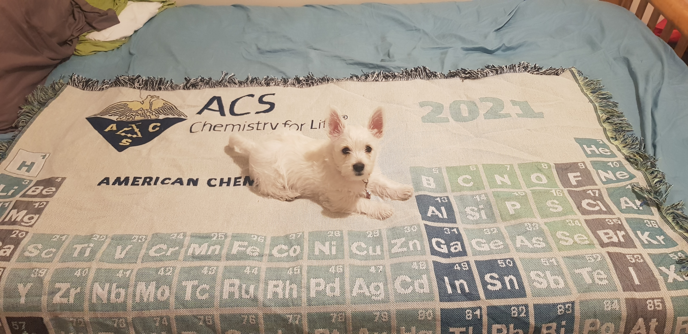

---
title: "The start of the academic puppy journey"
subtitle: "The arrival of the academic puppy"
excerpt: "How the academic puppy life started"
weight: 1
author: "Sara T. R. Velasquez"
date: 2023-09-16
draft: false
featured: true
categories:
  - Outreach
  - Academic puppy
  - Research Support

# layout options: single or single-sidebar
layout: single-sidebar
links:
- icon: open-access
  icon_pack: ai
  name: source
  url: 
---

<b>Graphical abstract.</b> Outreach activity in Sunshine School, Tegucigalpa, Honduras.

On Friday May 21st 2021, Kentwone Forest Primerose, aka Hedwig, was picked up in Edinburgh to start her journey as an academic puppy. Little she knew the contract she had signed a month before since the moment we first met, where she accepted to become a life long academic puppy. She arrived as the most wonderful gift, to remind me where home was and keep me going in the academic life. The moment she arrived, there was one promised made, no matter what, we would not give up academic opportunities because of her. 

