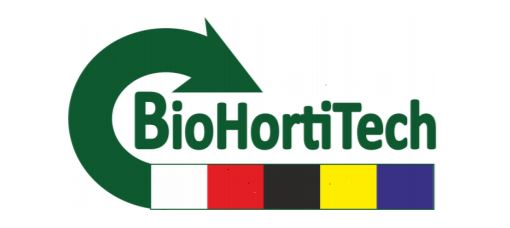

During the first year of my Post-Doctoral research, I participated on the BioHortiTech project, where I was developing layer-by-layer encapsulation of Trichoderma spores for plant protection. The encapsulated spores were tested in greenhouse and field through collaborations with inhort, Poland. 

https://www.suscrop.eu/projects-second-call/biohortitech  

The research developed throughout this project, has currently generated two papers, which can be found under publications. 

