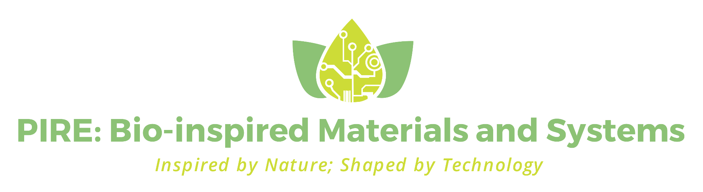

Crop protection usually involves treatment with pesticides, which harm the environment. Instead of pesticides in this project we will use wood byproducts as tiny carriers ("Green Guardians") to deliver green silver nanoparticles, which will protect against pathogens and strengthen plants. As such they will act like nanosized, eco-friendly bodyguards for plants. These nanocarriers, made using natural materials, will be designed to release silver nanoparticles when plants need it, e.g. when attacked by fungus. Not only will they keep plants safe but also help reduce chemical and microplastic pollution. Therefore, providing a circular win-win strategy for farmers and planet.

