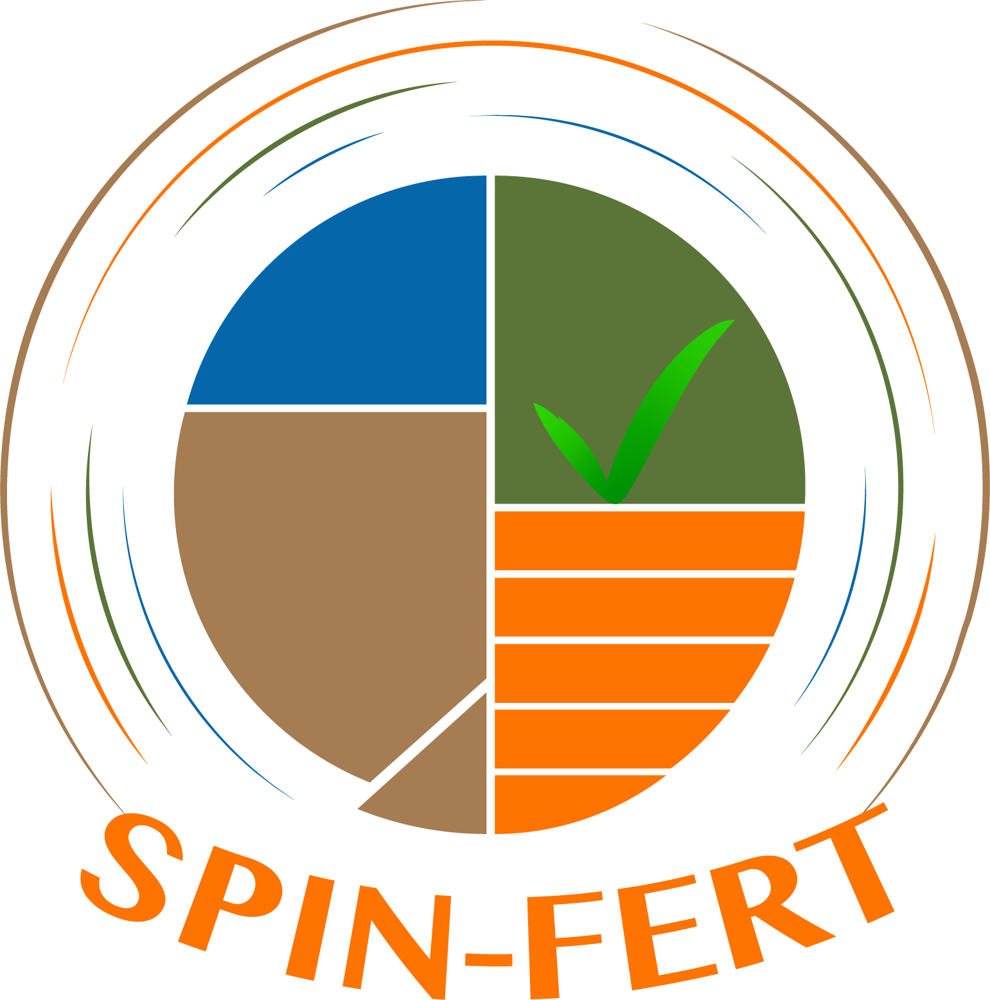

As a follow up to the layer-by-layer encapsulation during the BioHortiTech project. 

I will be collaborating with the PhD candidate from SPC, to develop the second generation of layer-by-layer encapsulation. This will be part of the WP2 which focuses on reducing the use of mineral fertilizers and synthetic pesticides through optimized biostimulant formulations and peat-free substrates. 

https://spinfert.eu/ 

