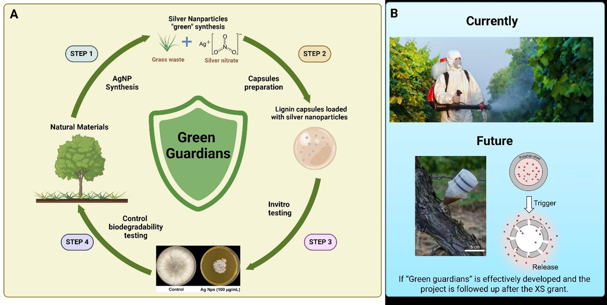

Mild Stroke Study 3 (MSS3) is a single centre longitudinal MRI study recruiting participants who have experience mild strokes. A detailed structural imaging protocol is acquired at baseline and every two-six months thereafter until 1 year, followed by another scan 3 years after the baseline. In addition we measure cerebrovascular reactivity, pulsatility and blood-brain barrier (BBB) leakage.

